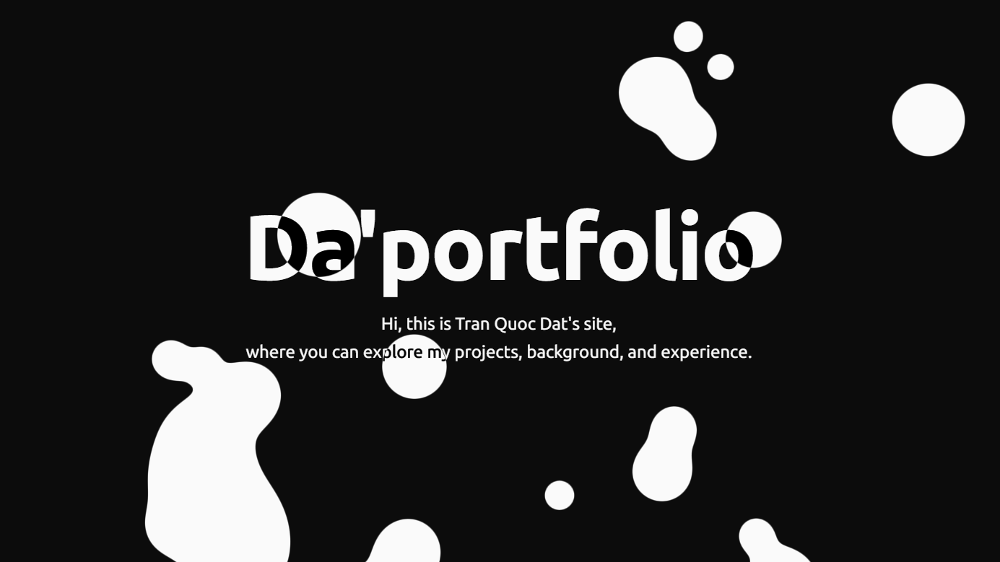

# Da'portfolio

Personal portfolio for Tran Quoc Dat, built with Next.js, React, TypeScript, and Tailwind CSS.

[Live site](https://tranquocdat.com) · [AI-readable profile](public/llms.txt)



## Experiences

- `/` — portfolio homepage with profile, experience, and contact details.
- `/projects` — selected project index.
- `/projects/[slug]` — Markdown-backed project case study.
- `/certificates` — professional and academic certificate index.

## Local development

Requirements: Node.js 22 or newer and npm. The repository `.nvmrc` selects Node.js 24.

```bash
npm ci
npm run dev
```

Copy `.env.example` to `.env.local` only when testing the GitHub contribution calendar. Never commit environment files.

## Quality checks

Run the same gate used by CI:

```bash
npm run check
```

Individual scripts are defined in [`package.json`](package.json). CI runs on pull requests and pushes to `main` through [`.github/workflows/quality.yml`](.github/workflows/quality.yml).

## Deployment

The production app runs on Cloudflare Workers through the OpenNext adapter. After `wrangler login`, use `npm run preview` for a Workers-runtime preview or `npm run deploy` to run a sanitized build and deploy. Configure `GITHUB_GRAPHQL_TOKEN` in an ignored `.dev.vars` file for local Workers previews and as a Worker secret in production. The release gate also builds the Worker bundle, so adapter regressions fail before deployment.

See [Deployment](docs/deployment.md) for the production target and rollback command.

## Maintaining content

See [Content management](docs/content-management.md). Architecture decisions and visual constraints live in [System architecture](docs/system-architecture.md) and [Design guidelines](docs/design-guidelines.md).
